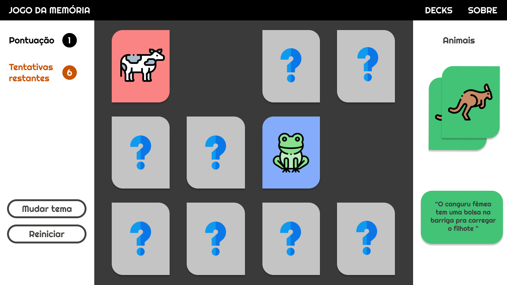

# Jogo da Memória (em desenvolvimento)
=====================================================================

> **[CLIQUE AQUI PARA VER O SITE](https://auroradark-jogodamemoria.netlify.app/)**

## Ideia da página inicial

[LINK DO DESIGN NO FIGMA](https://www.figma.com/file/x71PJgN77PFRs6JRUFQwFa/Jogo-da-Mem%C3%B3ria?node-id=0%3A1)

## Tecnologias (por enquanto)

O objetivo desse projeto é que ele seja desenvolvido 100% no frontend, com base no Javascript

* HTML, CSS e Javascript

## Sobre
 
>O jogo da memória é um clássico jogo formado por peças que apresentam uma figura em um dos lados. Cada figura se repete em duas peças diferentes. Para começar o jogo, as peças são postas com as figuras voltadas para baixo, para que não possam ser vistas. Cada participante deve, na sua vez,virar duas peças e deixar que todos as vejam. Caso as figuras sejam iguais, o participante deve recolher consigo esse par e jogar novamente. Se forem peças diferentes, estas devem ser viradas novamente, e sendo passada a vez ao participante seguinte. Ganha o jogo quem tiver mais pares no final do jogo.

>[Nosso querido WIKIPEDIA](https://pt.wikipedia.org/wiki/Jogo_de_mem%C3%B3ria)

Bom, nesse caso o jogo é **quase** assim. A única diferença é que você joga **contra si mesmo**.

### Como funciona?

O jogador tem uma quantidade **limitada** de jogadas. Se exceder essa quantidade ele perderá o jogo. 
O objetivo no entanto continua o mesmo: Conseguir todos os pares. A pontuação varia de acordo com a quantidade de **erros**.

### Alguns recursos da interface...

* Mudar tema - Sim, isso mesmo kkkkk eu **pretendo** colocar temas, então digamos que é só um insight por enquanto.

* Reiniciar - Cansou dessa partida? Não tem problema. Só jogar outra!

**Autor: [@AuroraDark](https://github.com/AuroraDark) :)** 
