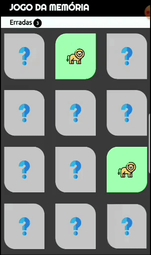
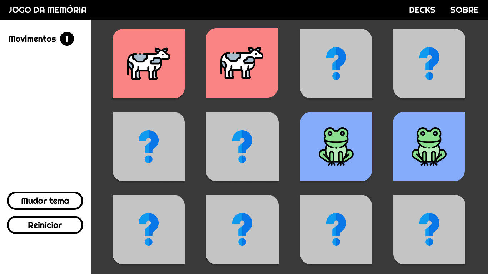

# Jogo da Memória 

## Etapas do projeto

- [x] Design no figma **[-> LINK DO DESIGN NO FIGMA](https://www.figma.com/file/x71PJgN77PFRs6JRUFQwFa/Jogo-da-Mem%C3%B3ria?node-id=0%3A1)**
- [x] Design na página (HTML e CSS)
- [x] Design das cartas (HTML E CSS)
- [x] Lógica do jogo (Javascript)(o jogo está funcionando!!)
- [x] Site no AR  **[-> CLIQUE AQUI PARA VER O SITE](https://auroradark-jogodamemoria.netlify.app/)**
- [x] Layout responsivo
- [x] Exibir mensagem de vitória
- [x] Botão para reiniciar o jogo
- [ ] Botão para mudar tema **(EM BREVE)**

## Prints

### Desktop (imagem desatualizada, agora possui botão de reiniciar!)

### Celular (gif desatualizado, agora possui botão de reiniciar!)

---
## Print da página inicial do figma

## Tecnologias (100% front-end)

* HTML, CSS e Javascript

## Sobre
 
>O jogo da memória é um clássico jogo formado por peças que apresentam uma figura em um dos lados. Cada figura se repete em duas peças diferentes. Para começar o jogo, as peças são postas com as figuras voltadas para baixo, para que não possam ser vistas. Cada participante deve, na sua vez,virar duas peças e deixar que todos as vejam. Caso as figuras sejam iguais, o participante deve recolher consigo esse par e jogar novamente. Se forem peças diferentes, estas devem ser viradas novamente, e sendo passada a vez ao participante seguinte. Ganha o jogo quem tiver mais pares no final do jogo.

>[Nosso querido WIKIPEDIA](https://pt.wikipedia.org/wiki/Jogo_de_mem%C3%B3ria)

Bom, nesse caso o jogo é **quase** assim. A única diferença é que você joga **contra si mesmo**.

### Alguns recursos da interface...

* Você poderá ver a quantidade de erros e comparar com os outros jogadores

* Mudar tema - Sim, isso mesmo kkkkk eu **pretendo** colocar temas, então digamos que é só um insight por enquanto.

## OBRIGADA :D

**Agradeço a todos que testaram e me deram novas ideias, com base nelas fiz e continuo fazendo alterações no projeto inicial para melhorar a experiência do jogador!** 

**Autor: [@AuroraDark](https://github.com/AuroraDark) :)** 
